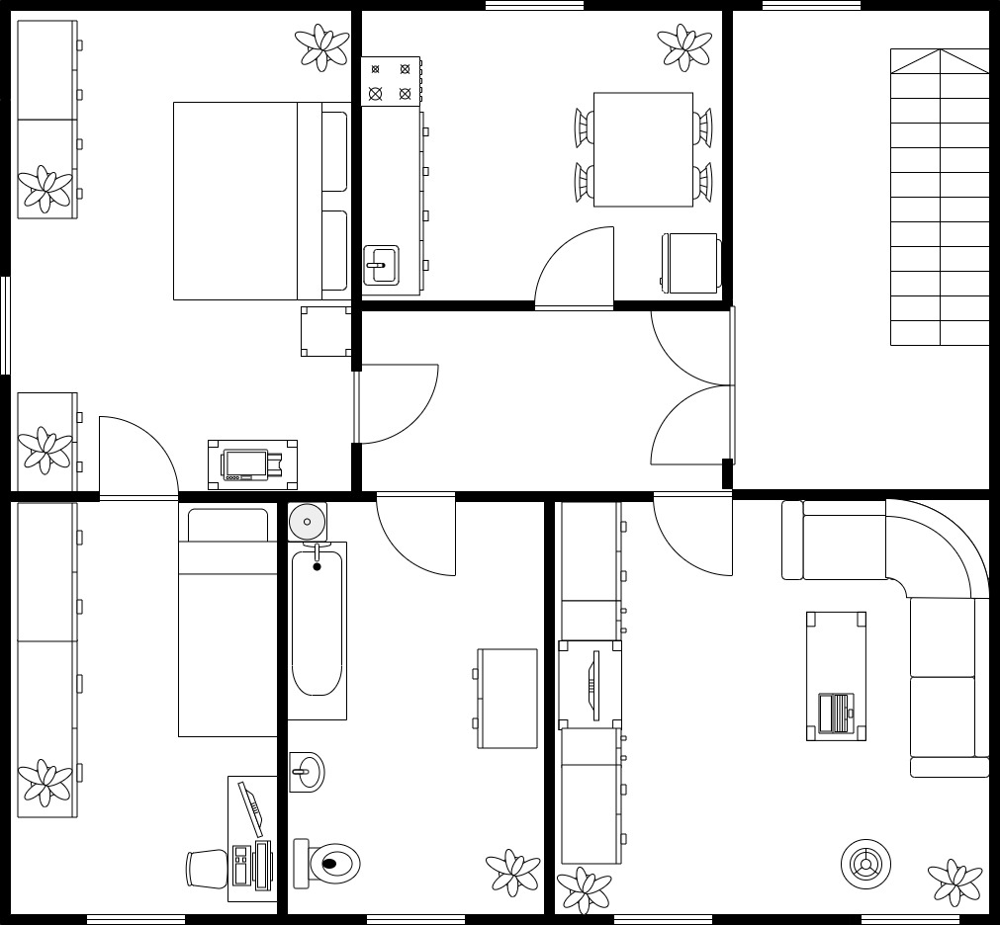
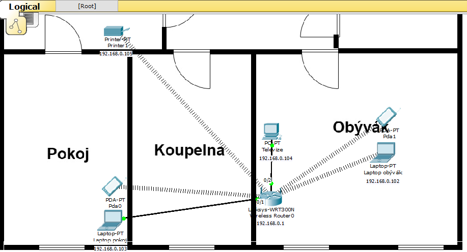

# Návrh domácí sítě
Tato práce je dělaná podle reálné předlohy našeho bytu. Zároveň jsem si přidal věci, které bychom mohli do budoucna využít jako přidělení IP adres a pár zařízení navíc. Vytvořil jsem funkční simulaci této sítě přes Packet Tracer takže doporučuji vyzkoušet. Jelikož není v programu Smart TV tak jsem místo toho použil PC. Router má příjem LTE takže není potřeba řešit zásuvku na internet.
### Zde je fyzická topologie:

### Zde je logická topologie:

### Nastavení IP adres a připojení v Packet Tracer:

## Zařízení a ceny
- Smart TV = 10 990Kč
- herní notebook = 29 989Kč
- notebook pro běžné použití = 7000Kč
- LTE router = 2500Kč
- Wi-Fi tiskárna = 1400Kč
- domácí kino = 6000Kč
- Satelitní parabola = 1000Kč
- Anténa se zesilovačem = 1700Kč
## kabeláž:
- UTP kabel RJ45 kat.6 5m = 110Kč
- Audio kabel + optický 10m = 130Kč
- Koaxiální kabel = 225Kč
### celková cena:
**61634Kč**
