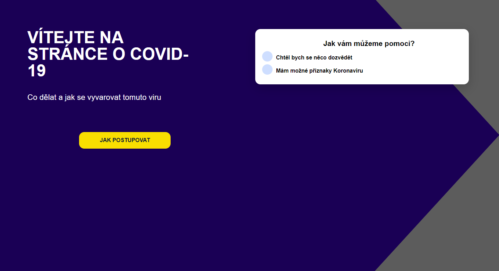
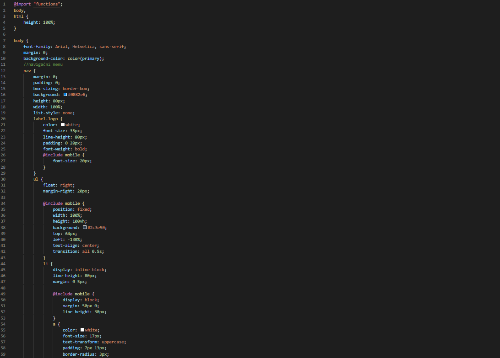

# Stránka o koronaviru
v tomto projektu jsem se snažil využívat responzivity a funkčního menu. Zároveň jsem se snažil udělat stránku minimalistickou a přehlednou.
## Screenshoty samotné stránky
### hlavní stránka

#### mobilní verze

### Jak postupovat

.png)
#### mobilní verze

m.png)
m.png)
### možné příznaky

#### mobilní verze

m.png)
### informace

#### mobilní verze

## Screenshoty zdrojových kódů
### Hlavní stránka HTML

### CSS

### Jak postupovat HTML

html.png)
html.png)
### CSS

.png)
.png)
### Možné příznaky HTML

html.png)
### CSS

.png)
.png)
### Informace HTML

### CSS

.png)
.png)
